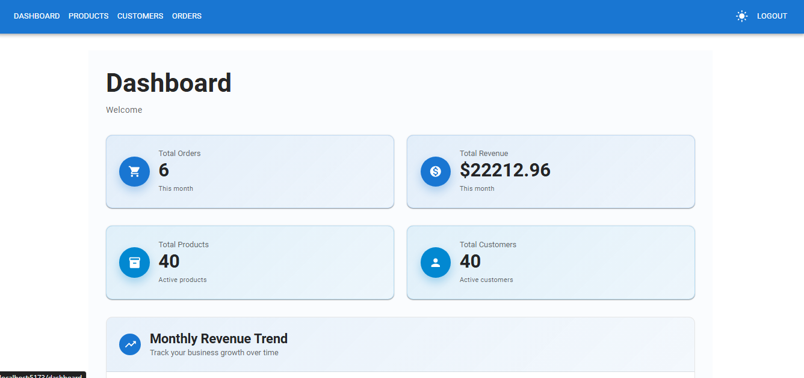
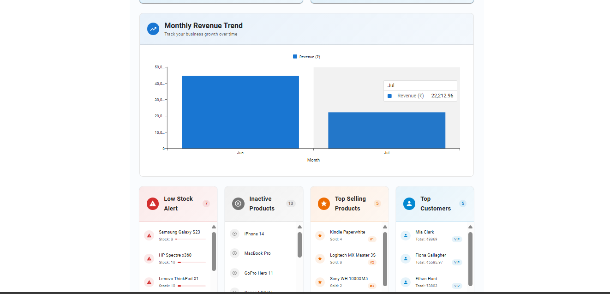
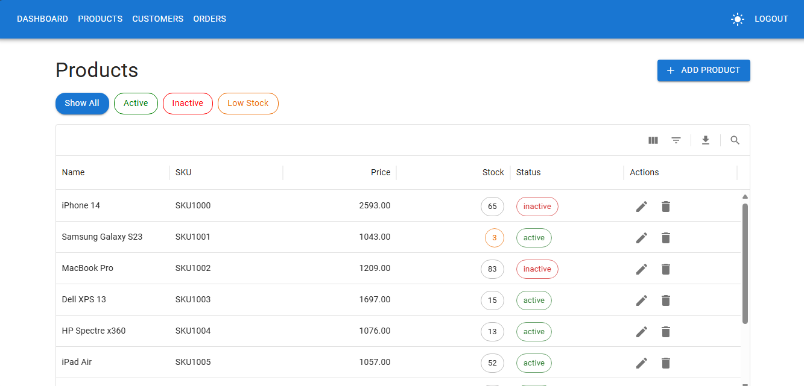
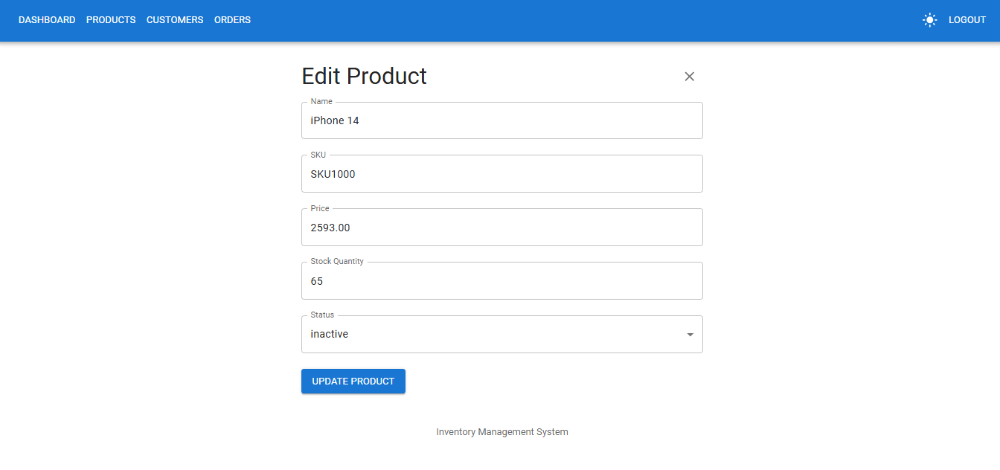
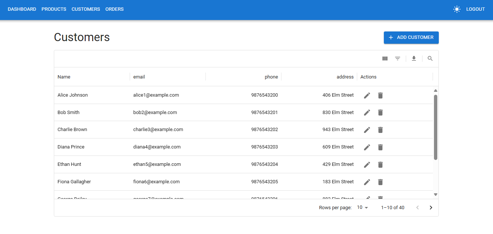
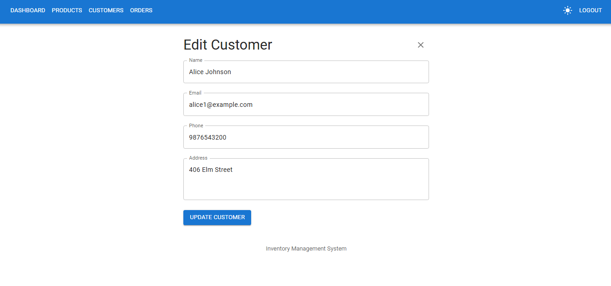
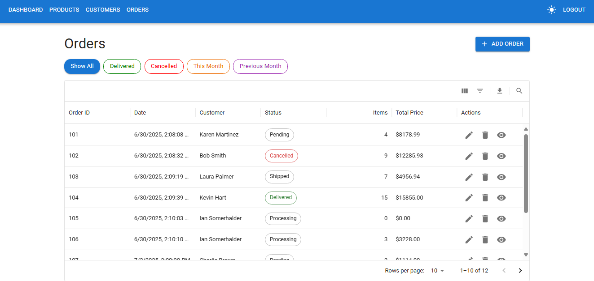
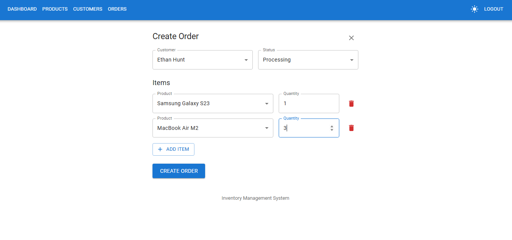
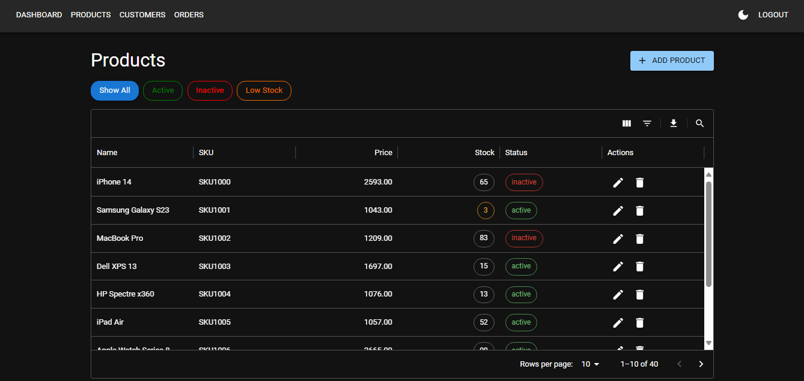

# 📦 Inventory & Order Management System (IOMS)

A backend-heavy full-stack application where an **Admin** can manage products, customers, and orders — simulating real-world inventory and order workflows for small businesses.

---

## Features

- JWT-based authentication (access & refresh tokens)
- Admin-only access control
- Light and dark theme toggle
- Product CRUD with stock tracking, status toggle, filters & pagination
- Customer CRUD (as data entries, not users)
- Order CRUD management with lifecycle (Pending → Delivered), cancellation, and stock updates
- Quick filters and advanced filtering across all modules
- Dashboard with revenue chart, total revenue, total orders, top products and top customers 
- Real-time low-stock alerts and top-selling product insights
- Monthly revenue and order analytics visualization

---

## Tech Stack

### Backend
- Python, Django, Django REST Framework
- SQLite for local dev
- Simple JWT for token-based authentication

### Frontend
- React with TypeScript
- Material UI + MUI X DataGrid & Charts
- Axios for API integration
- React Router for routing

---

## Getting Started

### 1. Clone the Repository

```bash
git clone https://github.com/rishitaraii/IOMS.git
cd IOMS
```

### 2. Setup Backend (Django)

```bash
cd IOMS_backend

# Create virtual environment
python -m venv venv
#On Linux/macOS: source venv/bin/activate   # On Windows: venv\Scripts\activate

# Install dependencies
pip install -r requirements.txt

# Apply migrations
python manage.py migrate

# Create superuser
python manage.py createsuperuser

# Run server
python manage.py runserver
```

### 3. Setup Frontend (React)

```bash
cd IOMS_frontend

# Install dependencies
npm install

# Start development server
npm run dev   
```

---


## Project Structure

```
IOMS/
├── IOMS_backend/           # Django backend (API)
│   ├── authentication/
│   ├── customers/
│   ├── dashboard/
│   ├── inventory/
│   ├── orders/
│   └── IOMS_backend/
├── IOMS_frontend/          # React frontend (TypeScript + MUI)
│   ├── public/ 
│   └── src/ 
│   ├── api/ 
│   ├── components/         # All UI components and page layouts
│   ├── redux/ 
│   ├── types/
│   ├── App.tsx             # Main app layout and routing
│   └── main.tsx            
├── README.md
└── requirements.txt
```

---

## Admin Credentials

> Set while running `createsuperuser` in Django  
> You can log in at `/login` on the frontend

---

## Screenshots

### Dashboard




### Product Management

#### 🔍 Product List (with filtering & pagination)


#### ➕ Add / Edit Product Form


### Customer Management

#### 🔍 Customer List


#### ➕ Add / Edit Customer Form


### Order Management

#### 🔍 Order List (with status filter)


#### ➕ Create/Edit Order



### 🌙 Dark Mode Preview




